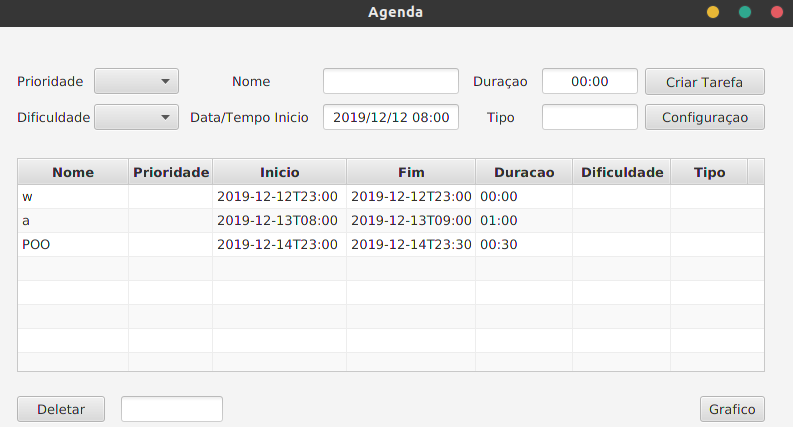

Smart Scheduler / Agenda Inteligente

Em desenvolvimento.

1. Introdução

    Uma agenda criada para otimizar o tempo do usuário, com relação ao planejamento e replanejamento de sua rotina.  Para isso foi visado diminuir a necessidade de certos inputs, e criar relação consistente entre as tarefas.
    
2. Funcionalidades

    Para o uso adequado, inicialmente é indicado estipular um ou mais horários indisponíveis para tarefas, um intervalo, por exemplo 22:00 às 06:00, para isso o usuário deve abrir a janela configurações e inserir os dados de hora início e hora final. Para a criação de tarefas , existem seis parâmetros a serem preenchidos, sendo estes; prioridade(P1, P2, P3), nome, duração da tarefa, dificuldade(trivial, fácil, média, difícil), data e hora de início da tarefa e o tipo(ex: Universidade, Trabalho, Casa...) . Apenas os campos data e hora de início, duração e nome são obrigatórios.
    Assim que criada, a aplicação verifica se o horário estipulado pelo usuário já está ocupado por uma outra tarefa ou por um horário de intervalo. Caso não, a tarefa é alocada normalmente, caso sim, é alocada para a próxima data/hora não ocupada por um intervalo, caso já exista ali uma outra tarefa, esta é “empurrada” o tempo necessário e as seguintes também.

